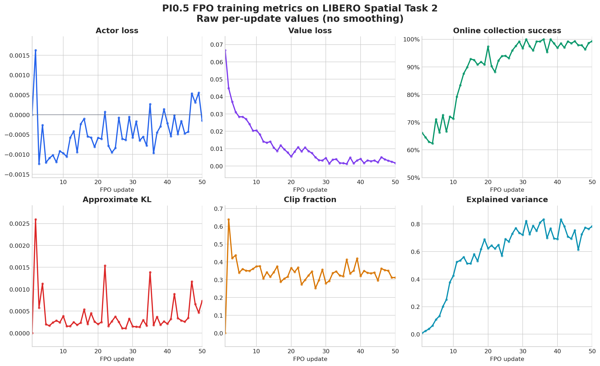
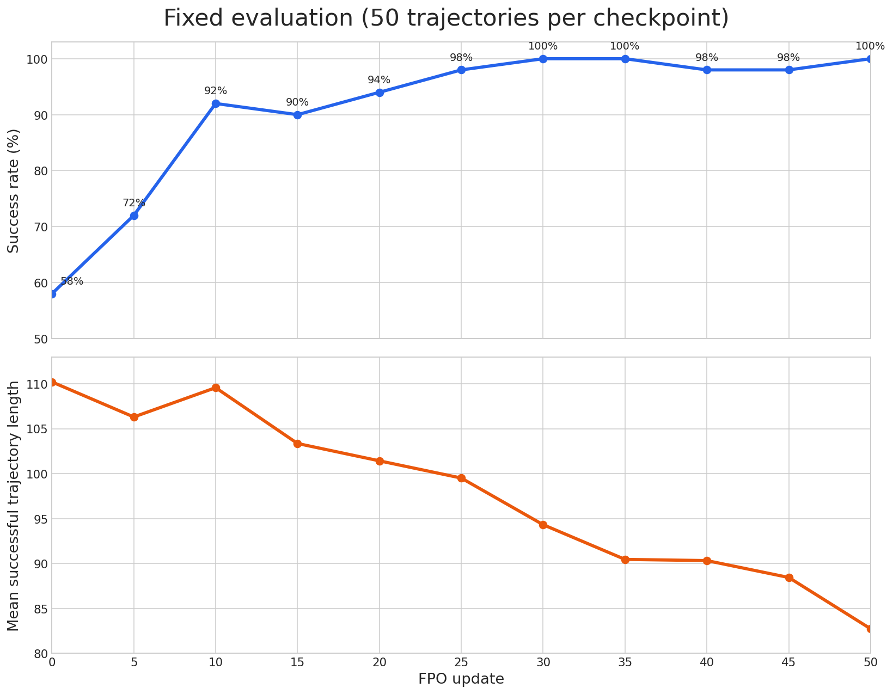

# PI0.5 FPO on LIBERO Spatial Task 2

This guide reproduces the reference FPO experiment
on LIBERO Spatial task 2: “pick up the black bowl from table center and place
it on the plate.” It starts from the deliberately undertrained
[`Miical/pi05-libero-spatial-sft-step-100`](https://huggingface.co/Miical/pi05-libero-spatial-sft-step-100)
checkpoint and updates the native PI0.5 policy directly.

The reference run improved fixed 50-trajectory success from 29 of 50 (58%) to
50 of 50 (100%). It reached 92% after 10 updates and remained between 98% and
100% from update 25 through update 50.

## Install the environment

Complete the
[PI0.5 LIBERO Spatial environment setup](../../../fine-tuning/pi05/libero-spatial.md)
before starting this recipe. FPO uses the same repository-local `.venv`, PI0.5
dependencies, LIBERO assets, and standard Hugging Face cache; no additional
Python packages are required.

The verified topology uses eight H20 GPUs for PI0.5 and four CPU workers, each
hosting eight LIBERO environments through OSMesa. Keep `.venv` activated while
training and monitoring the run.

## Start training

Run the maintained launcher from the repository root:

```bash
bash examples/rl/fpo/pi05/libero_spatial_task2_online_from_sft_step100/run_train.sh
```

The launcher selects
`examples/rl/fpo/pi05/libero_spatial_task2_online_from_sft_step100/fpo.yaml`.
The YAML owns the task, FPO algorithm, rollout schedule, optimizer settings,
evaluation cadence, and checkpoint lifecycle. The launcher supplies the model
and output locations, GPU and CPU resources, OSMesa rendering, and TensorBoard
directory.

The workflow starts a local Ray runtime; no separate `ray start` command is
required. It resumes the latest full checkpoint when the output directory
already contains one. Set a fresh run root to start an independent experiment:

```bash
FPO_OUTPUT_DIR=./outputs/rl/fpo/pi05/my-task-2-run \
  bash examples/rl/fpo/pi05/libero_spatial_task2_online_from_sft_step100/run_train.sh
```

Append Hydra overrides after the launcher to adapt the machine topology or
training schedule.

## Outputs and monitoring

Artifacts are derived from one run root:

```text
outputs/rl/fpo/pi05/libero-spatial-task2-online-from-sft-step100/
├── checkpoints/
└── tensorboard/
```

The reference configuration evaluates and saves every five updates. A complete
PI0.5 FPO checkpoint, including eight FSDP model and optimizer shards, the
value-head state, and a native Hugging Face export, occupies approximately
31.5 GB. Use `cluster.checkpoint.max_actor_ckpt_to_keep` when the machine cannot
retain all ten checkpoints.

Start TensorBoard in another terminal:

```bash
source .venv/bin/activate
tensorboard \
  --logdir outputs/rl/fpo/pi05/libero-spatial-task2-online-from-sft-step100/tensorboard \
  --bind_all \
  --port 6009
```

Use `val/trajectory_success_rate` for checkpoint selection. Online
`data/trajectory_success_rate` measures training collection and is not the
fixed evaluation benchmark.

## FPO

For every collected action chunk, the worker samples four fixed flow times and
noise tensors and evaluates them under the rollout and current policies. The
difference between their conditional flow-matching losses is used as the log
ratio in a clipped PPO surrogate. Ratios are summed over executed action steps
and averaged over the four Monte Carlo samples.

A separate MLP value head is trained with semi-Markov GAE, whose discount
exponents reflect the low-level environment steps executed by each action
chunk. The first update trains only the value head. Later updates jointly train
the policy and value head for two epochs. The synchronous rollout boundary
keeps collection on-policy.

## Reference configuration

| Setting | Value |
| --- | --- |
| Task | LIBERO Spatial task 2 (zero-based ID `2`) |
| Starting policy | PI0.5 SFT step 100 |
| Training updates | 50 |
| Model resources | 8 H20 GPUs, FSDP2 BF16 |
| Environment resources | 4 CPU workers, 8 environments each |
| Rollout pipeline / interactions | 2 stages / 20 action chunks |
| Action chunk size / episode limit | 10 / 200 environment steps |
| Global mini batch / micro batch | 128 / 4 |
| CFM samples per chunk | 4 |
| Update epochs | 2 |
| Actor / value learning rate | `1e-5` / `1e-4` |
| PPO clipping radius / target KL | `0.01` / `0.1` |
| Actor / value gradient clipping | `25.0` / `25.0` |
| Discount / GAE lambda | `0.995` / `0.99` |
| Rollout mode | Synchronous |
| Evaluation and checkpoint interval | Every 5 updates |
| Evaluation size | 50 trajectories, including before training |
| Recording | Disabled |

Four CFM samples and two update epochs were selected for fast iteration on the
eight-H20 host. Prefix KV-cache reuse avoids repeating the image/language
prefix forward for every CFM sample, while deferred FSDP synchronization avoids
an all-reduce for every microbatch. Complete actor updates took approximately
80–82 seconds; the prior implementation took approximately 197 seconds.

## Training metrics



These are the raw metrics logged after every update, without smoothing. The
online collection success rate rose from 66.2% at update 1 to 99.3% at update
50, broadly tracking the independent fixed evaluation while using a different
set and number of trajectories. Value loss fell from 0.0668 to 0.00177, and
explained variance rose from 0.009 to 0.783, indicating that the learned value
head became substantially more predictive over the run.

Actor loss oscillated close to zero, as expected for the signed clipped
surrogate, while approximate KL stayed far below the `0.1` stopping threshold.
The clipping fraction settled mostly between 0.25 and 0.42 after the initial
updates; this is consistent with the deliberately tight `0.01` clipping
radius. The curves combine the original updates 1–30 and updates 31–50 after
resuming from the complete step-30 checkpoint.

## Reference results

| FPO update | Successful trajectories | Success rate | Mean successful trajectory length |
| ---: | ---: | ---: | ---: |
| 0 | 29 / 50 | 58% | 110.21 |
| 5 | 36 / 50 | 72% | 106.31 |
| 10 | 46 / 50 | 92% | 109.57 |
| 15 | 45 / 50 | 90% | 103.36 |
| 20 | 47 / 50 | 94% | 101.43 |
| 25 | 49 / 50 | 98% | 99.51 |
| 30 | 50 / 50 | 100% | 94.32 |
| 35 | 50 / 50 | 100% | 90.46 |
| 40 | 49 / 50 | 98% | 90.33 |
| 45 | 49 / 50 | 98% | 88.45 |
| 50 | 50 / 50 | 100% | 82.74 |



The policy converged quickly: most of the success-rate gain occurred in the
first ten updates, and success was already 98% at update 25. Continuing to
update 50 shortened the mean successful trajectory from 110.21 to 82.74 steps
while retaining 100% success in the final fixed evaluation. The step-30
checkpoint scored 98% in a second evaluation performed when the run resumed,
which illustrates the sampling uncertainty of a 50-trajectory benchmark.

The reference execution was resumed once from the complete step-30 checkpoint.
Checkpoint 50 contains all eight model, optimizer, extra-state, and value-head
shards plus the native Hugging Face policy export. It is the recommended
checkpoint because it combines 100% measured success with the shortest mean
successful trajectory in this run.
